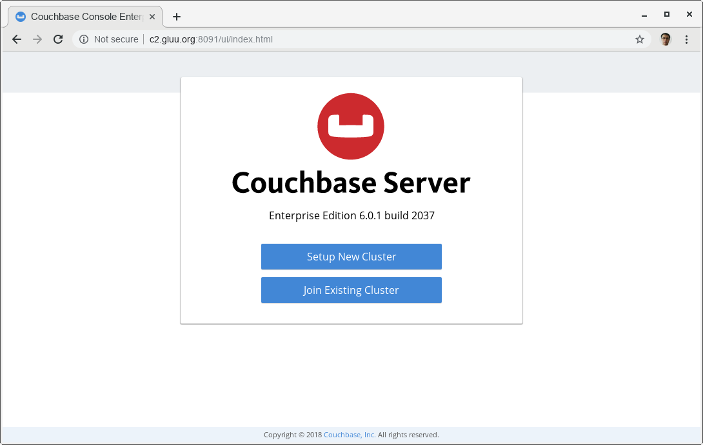
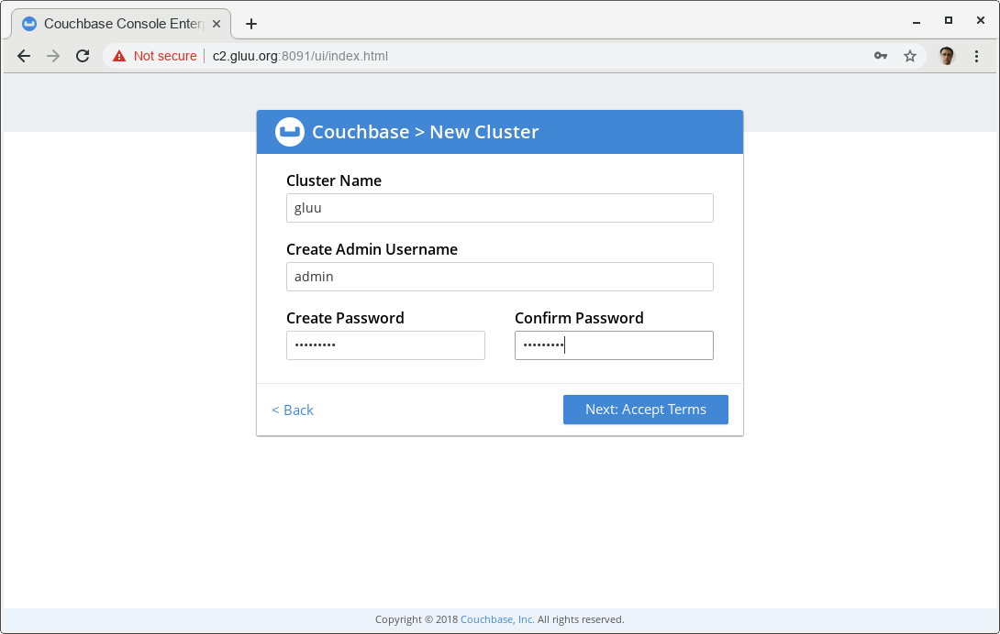
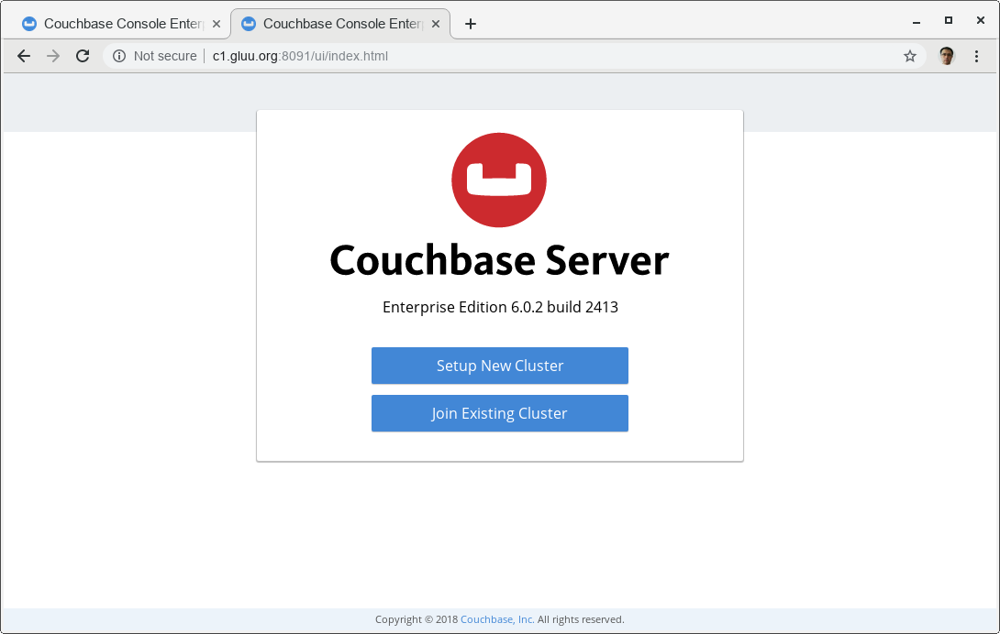
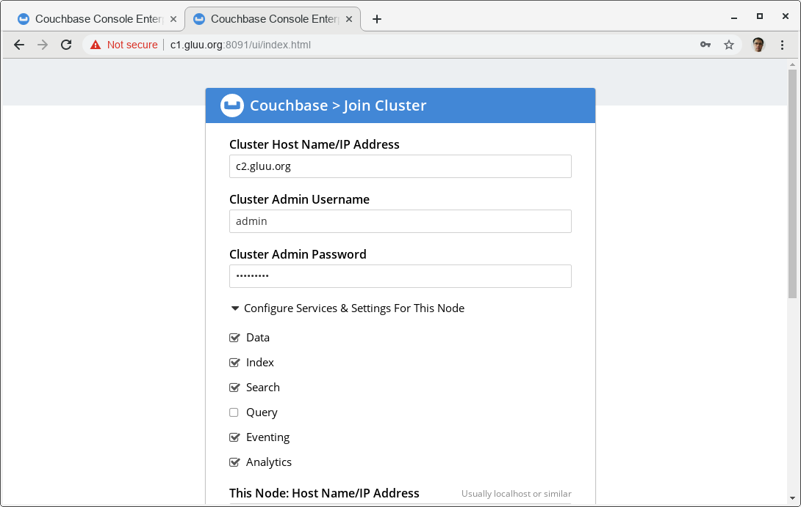
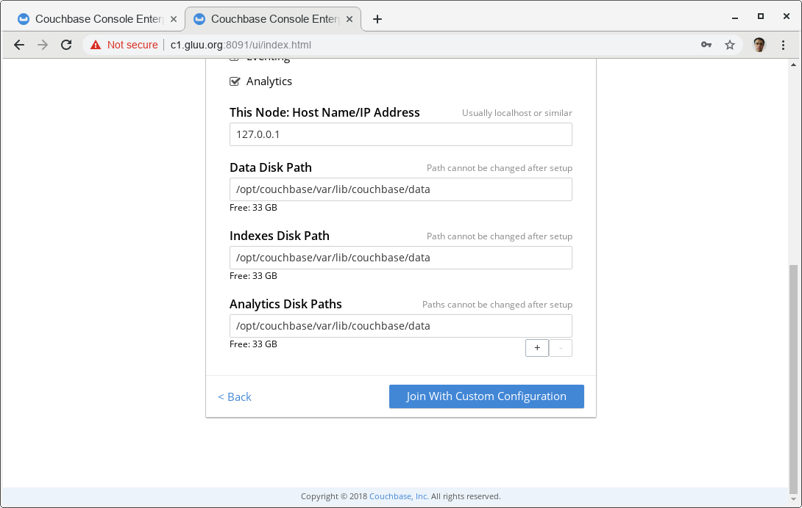
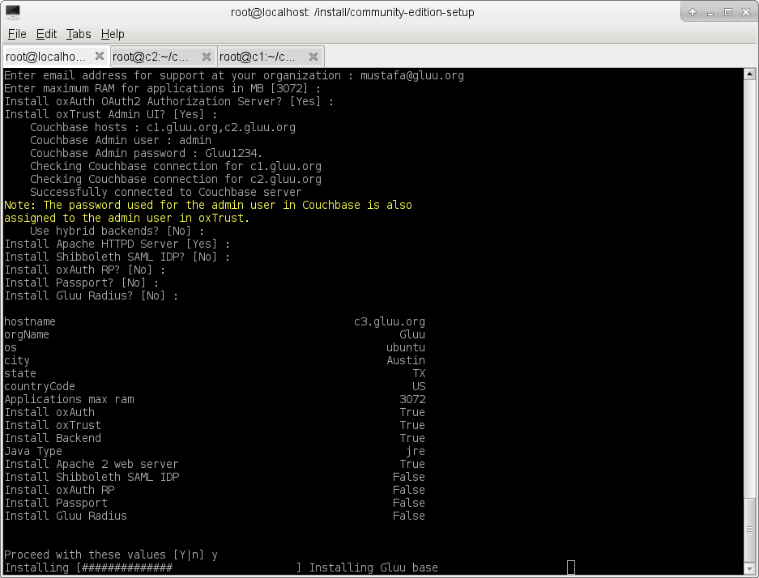

# Requirements
* two VM for couchbase clusterd, in our case they are c1.gluu.org and c2.gluu.org, they are both CentOS7
* one VM for gluu-4.0, in our case it is c3.gluu.org, Ubuntu16
* These ports should be opened accoss all three servers: 4369, 8091 to 8094, 9100 to 9105, 9998, 9999, 11207, 11209 to 11211,
11214, 11215, 18091 to 18093, and from 21100 to 21299.


# Installing couchbase servers

## Node1:
I choose c2.gluu.org as node 1. Simply execute the following command 

```
# rpm -i couchbase-server-enterprise-6.0.1-centos7.x86_64.rpm
```

After installation, I visit http://c2.gluu.org:8091/ to setup cluster



I click "Setup New Cluster" In the upcoming screen, I enter credidentals.



Then click "Next: Accept Terms". In the next screen finish setup with choosing default settings. 
Node 1 will have Query Service.

## Node2:
c1.gluu.org is my node 2. Simply execute the following command 

```
# rpm -i couchbase-server-enterprise-6.0.1-centos7.x86_64.rpm
```

After installation, I visited http://c1.gluu.org:8091/



I click "Join Existing Cluster", in the next screen I entered credidentals that
I entered while setting up Node 1. Note that "Cluster Hostname" is address of first
node, in my case it is c2.gluu.org



Since I want Query Service only on the first node, I unchecked "Query" under
"Configure Services" tab. Of course, you can use multiple Query Service nodes and leave it checked.
setup.py will automatically find query service, trying from the first node.



I clicked "Join With Custom Configuration" button

# Installing Gluu Server 4.0

Install Gluu Server 4.0 as explained here https://gluu.org/docs/ce/4.0/installation-guide/install-ubuntu/

run setup.py with `--remote-couchbase` argument:

```
# ./setup.py --remote-couchbase
```

When it asks couchbase hosts, write comma seperated hostnames as `c1.gluu.org,c2.gluu.org`




