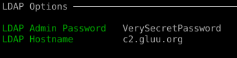

# CE4.1 with Remote LDAP

## Prepare LDAP Server
### Install Java

 - on CentOS8/RHEL8:
  `dnf install java-11-openjdk-headless`
 - on Ubuntu 20:
  `apt install openjdk-11-jre-headless`

### Install OpenDJ
```
wget https://jenkins.gluu.org/maven/org/gluufederation/opendj/opendj-server-legacy/4.4.12/opendj-server-legacy-4.4.12.zip -O /opt/opendj-server-legacy-4.4.12.zip
cd /opt/
unzip opendj-server-legacy-4.4.12.zip
wget https://raw.githubusercontent.com/GluuFederation/community-edition-setup/version_4.3.1/static/opendj/101-ox.ldif -O /opt/opendj/template/config/schema/101-ox.ldif
wget https://raw.githubusercontent.com/GluuFederation/community-edition-setup/version_4.3.1/static/opendj/77-customAttributes.ldif -O /opt/opendj/template/config/schema/77-customAttributes.ldif
wget https://raw.githubusercontent.com/GluuFederation/community-edition-setup/version_4.3.1/static/opendj/96-eduperson.ldif -O /opt/opendj/template/config/schema/96-eduperson.ldif
```

Write the following content to `/opt/opendj/setup.properties`, before running installation do not forget to change `hostname` and `rootUserPassword`:


```
hostname                        =c2.gluu.org
rootUserPassword                =VerySecretPassword

##### do not change below this line #######
generateSelfSignedCertificate   =true
enableStartTLS                  =false
ldapsPort                       =1636
adminConnectorPort              =4444
rootUserDN                      =cn=directory manager
baseDN                          =o=gluu
backendType                     =je
```

To rtart installation execute the following command

`/opt/opendj/setup --cli --propertiesFilePath /opt/opendj/setup.properties --acceptLicense --no-prompt`

## Install CE-4.3.1
Download latest CE-4.3.1 from https://repo.gluu.org/# and install with package manager:

- on CentOS8
  `rpm -i gluu-server-4.3.1-centos8.x86_64.rpm`
- on RHEL8
  `rpm -i gluu-server-4.3.1-rhel8.x86_64.rpm`
- on Ubuntu20
  `dpk -i gluu-server_4.3.1~ubuntu20.04_amd64.deb`

 Start container and login to container.

 setup.py will ask you ldap server host and password, for example:


