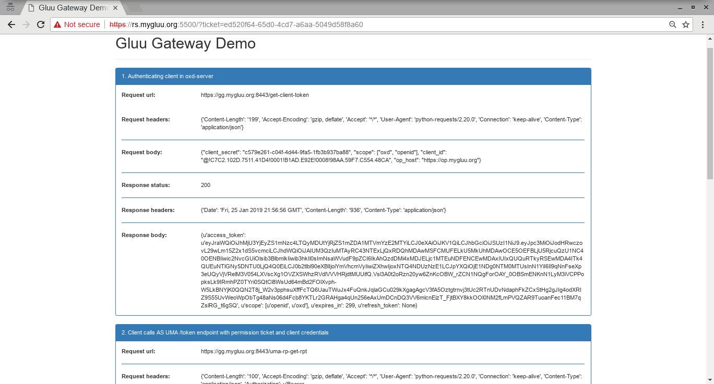

# Gluu Gateway Demo Flask Application

Requirements
============
For this demo I will use the following VM's.

|Name                    |IP Address      |Hosts            |OS                                |
|------------------------|----------------|-----------------|----------------------------------|
|Resource Server         |192.168.56.1    |rs.mygluu.org    |Any OS on which Python/flask runs |
|Upstream Server         |192.168.56.101  |claim-gatering.mygluu.org, none-claim-gatering.mygluu.org | Any OS on which Python/flask runs|
|OpenID Connect Provider |192.168.56.102  |op.mygluu.org    |Any Linux supported by Gluu Server|
|Gluu Gateway            |192.168.56.104  |gg.mygluu.org    |Currently I use Ubuntu 16.04 LTS  |


Since I am using virtual IP/hosts I write the following content to file `/etc/hosts` on each machine

```
192.168.56.1 rs rs.mygluu.org
192.168.56.101 us claim-gatering.mygluu.org
192.168.56.101 us none-claim-gatering.mygluu.org
192.168.56.102 op op.mygluu.org
192.168.56.104 gg gg.mygluu.org

```

OpenID Connect Provider
-----------------------
As OpenID Connect Provider I sue Gluu Server. Please install Gluu Server by following
instruction explained [here https://gluu.org/docs/ce/installation-guide/]((https://www.google.com "Google's Homepage"))


Gluu Gateway
------------
For this demo, I used Gluu Gateway (GG) 4.0bta. Please install Gluu Gateway by following
instruction explained [here https://gluu.org/docs/gg/installation/](https://gluu.org/docs/gg/installation/)

GG UI is only available on localhost. Sice it is on a remote machine, we need ssh port forwarding
to reacg GG UI. My GG IP is 192.168.56.104, thus:

`$ ssh -L 1338:localhost:1338 user@192.168.56.104`

Where `user` is any username that can make ssh to GG host. On your desktop open a browser and navigate
to the following address:

https://localhost:1338

Your GG UI will come, login to GG UI with your Gluu Server **admin** credidentals.


Resource Server
---------------

I am assuing that Python and pip is installed on this server. Install Flask and pyOpenSSL

```
# pip install flask 
# pip install pyopenssl 
```

Download gg_demo_app.py:

`wget https://raw.githubusercontent.com/mbaser/gluu/master/gluu_gateway_demo/gg_demo_app.py`

And run as:
`# python gluu_gateway_demo/gg_demo_app.py`

This will output something like:
 



