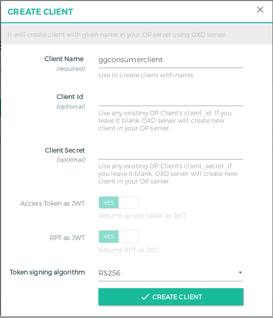

# Gluu Gateway Demo Flask Application

Requirements
============
For this demo I will use the following VM's.

|Name                    |IP Address      |Hosts            |OS                                |
|------------------------|----------------|-----------------|----------------------------------|
|Resource Server         |192.168.56.1    |rs.mygluu.org    |Any OS on which Python/flask runs |
|Upstream Server         |192.168.56.101  |claim-gatering.mygluu.org, none-claim-gatering.mygluu.org | Any OS on which Python/flask runs|
|OpenID Connect Provider |192.168.56.102  |op.mygluu.org    |Any Linux supported by Gluu Server|
|Gluu Gateway            |192.168.56.104  |gg.mygluu.org    |Currently I use Ubuntu 16.04 LTS  |


Since I am using virtual IP/hosts I write the following content to file `/etc/hosts` on each machine

```
192.168.56.1 rs rs.mygluu.org
192.168.56.101 us claim-gatering.mygluu.org
192.168.56.101 us none-claim-gatering.mygluu.org
192.168.56.102 op op.mygluu.org
192.168.56.104 gg gg.mygluu.org

```

Resource Server
---------------

I am assuing that Python and pip is installed on this server. Install Flask and pyOpenSSL

```
# pip install flask 
# pip install pyopenssl 
```

Download gg_demo_app.py:

`wget https://raw.githubusercontent.com/mbaser/gluu/master/gluu_gateway_demo/gg_demo_app.py`

And run as:
`# python gluu_gateway_demo/gg_demo_app.py`


Upstream Server
----------------
I am assuing that Python and pip is installed on this server. Install Flask and pyOpenSSL

```
# pip install flask 
# pip install pyopenssl 
``` 

Download gg_demo_app.py:


`wget https://raw.githubusercontent.com/mbaser/gluu/master/gluu_gateway_demo/gg_upstream_app.py`

And run as:
`# python gluu_gateway_demo/gg_upstream_app.py`

It will listen port 5000 of all interfaces. Test if it is running:

```
$ curl -k https://claim-gatering.mygluu.org:5000/posts
{
  "location": "https://claim-gatering.mygluu.org:5000/posts", 
  "message": "I am a test flask-api for Gluu Gateway", 
  "time": "Mon Jan 28 16:03:16 2019"
}
```


OpenID Connect Provider
-----------------------
As OpenID Connect Provider I sue Gluu Server. Please install Gluu Server by following
instruction explained [here https://gluu.org/docs/ce/installation-guide/](https://gluu.org/docs/ce/installation-guide/)


Gluu Gateway
------------
For this demo, I used Gluu Gateway (GG) 4.0bta. Please install Gluu Gateway by following
instruction explained [here https://gluu.org/docs/gg/installation/](https://gluu.org/docs/gg/installation/)

GG UI is only available on localhost. Sice it is on a remote machine, we need ssh port forwarding
to reacg GG UI. My GG IP is 192.168.56.104, thus:

`$ ssh -L 1338:localhost:1338 user@192.168.56.104`

Where `user` is any username that can make ssh to GG host. On your desktop open a browser and navigate
to the following address:

https://localhost:1338

Your GG UI will come, login to GG UI with your Gluu Server **admin** credidentals.

The first thing is to create a consumer that will be used by Resource Server. For this, click **CONSUMERS**
on the left panel. Firstly we need to create a client for the consumer, click "+ CREATE CLIENT" button,
you just need to write **Client Name**, for this demo I wrote **ggconsumerclient**



Once you hit, you will see credidentals for consumer client, before closing the pop-up screen please copy
credidental info:


To create a consumer, click on "+ CREATE CONSUMER" button. On the popup screen, write a name for consumer, 
I wrote **ggconsumer** and write `Client Id` you to **Gluu Client Id**


Edit `gg_demo_app.py` on your **Resource Server** and replace values of `client_oxd_id`, `client_id` and `client_secret`
those you get while creating client for consumer. Since it is is degub mode it, program will reload automatically
so you don't need to restart. In my case:

```
# Consumer client
client_oxd_id = "80e6c1f8-76cb-4601-afb8-19866ed2a29a"
client_id = "@!C7C2.102D.7511.41D4!0001!B1AD.E92E!0008!B021.E33B.3261.AF1E"
client_secret = "73039435-13f4-4999-904f-31a69e946195"
```


 


