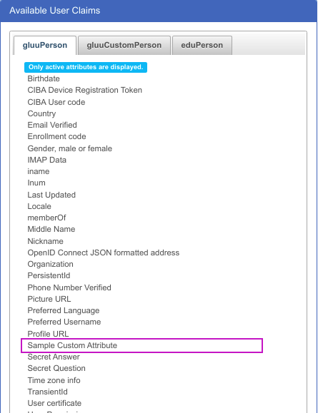

### Adding Custom Attributes when MySQL backend is used
1) Add a column to table gluuPerson in MySQL. Command will be
  `ALTER TABLE gluuPerson ADD COLUMN <claimName> <dataType>;`

  Choose dataType according to the following table

  | Gluu oxTrust UI Type | SQL dataType                                                                      |
  | -------------------- | --------------------------------------------------------------------------------- |
  | Text                 | VARCHAR(<SIZE>) *string value to be kept, SIZE is an integer for max string size* |
  | Numeric              | INT                                                                               |
  | Boolean              | SMALLINT                                                                          |
  | Binary               | BINARY                                                                            |
  | Certificate          | TEXT                                                                              |
  | Date                 | DATETIME(3)                                                                       |
  | Numeric              | INT                                                                               |
  | Multivalued          | JSON                                                                              |

  ! Note: if the attribute is Multivalued **dataType** should be JSON regardless of what you will chose for Type in Gluu oxTrust UI.

2) Register an attribute on Gluu oxTrust UI. When registering attribute **Name** `claimName`

# Example
We are going to add simple text attrbiute **customAttribute** with max size 200 characters.

  1) Use the following SQL command to add column
  ```
  mysql> ALTER TABLE gluuPerson ADD COLUMN customAttribute VARCHAR(100);
  Query OK, 0 rows affected (0.04 sec)
  Records: 0  Duplicates: 0  Warnings: 0
  ```

  2) On Gluu oxTrust UI go Configuration/Attributes and click **Register Attribute** button. Fill the fields according to your needs, 
  see following screenshot
  
  

  Once you registered attribute, you will see under Available User Claims / gluuPerson

  
  

