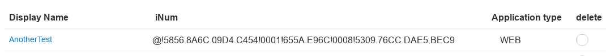

Creating Client Manually
------------------------

Login to Gluu server and go **OpenID Connect->Clients->Add Client**

Create Client with these properties, you can leave all other settings to defaults:

**Client Name:** OxdTutorialTestClient

**Client Description:** A test client for oxd.py cgi script

**Client Secret:** TopSecret

**Redirect Login URIs:** https://c3.gluu.org/cgi-bin/oxd.py/login

**Post Logout Redirect URIs:** https://c3.gluu.org/cgi-bin/oxd.py/logout 

**Grant Types:** authorization_code refresh_token client_credentials

**Pre-Authorization:** True

**Scopes:** openid oxd profile

Here is the relevant part of the screen:


When you click **Add** button, Gluu Server will create a client id for new client as:

```
@!5856.8A6C.09D4.C454!0001!655A.E96C!0008!5309.76CC.DAE5.BEC9
```
as below



You should use values entered here while registering your site to Oxd Server:

```
{
  "authorization_redirect_uri": "https://c3.gluu.org/cgi-bin/oxd.py/login",
  "op_host": "https://c2.gluu.org",
  "post_logout_redirect_uri": "https://c3.gluu.org/cgi-bin/oxd.py/logout",
  "application_type": "web",
  "response_types": ["code"],
  "grant_types": ["authorization_code", "client_credentials"],
  "scope": ["openid","oxd","profile"],
  "acr_values": ["basic"],
  "client_name": "AnotherTest",
  "client_jwks_uri": "",
  "client_token_endpoint_auth_method": "",
  "client_request_uris": [],
  "client_frontchannel_logout_uris": [],
  "client_sector_identifier_uri": "",
  "contacts": ["mustafa@gluu.org"],
  "redirect_uris": [],
  "ui_locales": [],
  "claims_locales": [],
  "claims_redirect_uri": [],
  "client_id": "@!5856.8A6C.09D4.C454!0001!655A.E96C!0008!5309.76CC.DAE5.BEC9",
  "client_secret": "TopSecret",
  "trusted_client": true
}
```
