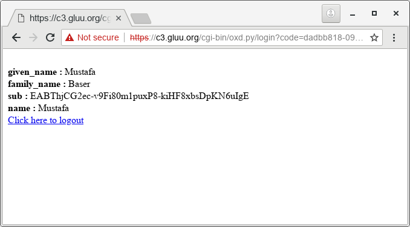

# Gluu Oxd Server Tutorial

In this tutorial I am going to explain how we can interact Gluu Oxd Server for SSO
with Python CGI, hoping that programmers of other languages will benefit.

## Perliminary

For this tutorail we need Gluu Server 3.1.4, Gluu Oxd Server 4.0 and https & cgi enabled
web server. 

### Gluu Server 3.1.4 (IDP OP)
Gluu Server will act as identiy providr (IDP). Follow 
[these instructions](https://gluu.org/docs/ce/3.1.4/installation-guide/install/) 
to install your Gluu Server. In this tutorial I installed Gluu Server on host **c2.gluu.org**
Add a test user. I added user `mbaser`

### Gluu Oxd Server 4.0
We will use Gluu Oxd Server 4.0, Follow 
[these instructions](https://github.com/GluuFederation/oxd/wiki/oxd-4.0.beta) 
to install your Gluu Oxd Server. I installed Gluu Oxd Server on host **c3.gluu.org**.
My **defaultSiteConfig** seciton of configuration `oxd-server.yml` is as followd:

```
defaultSiteConfig:
  op_host: 'https://c2.gluu.org'
  op_discovery_path: ''
  response_types: ['code']
  grant_type: ['authorization_code']
  acr_values: ['']
  scope: ['openid', 'profile']
  ui_locales: ['en']
  claims_locales: ['en']
  contacts: []
```

### Apache Web Server (SP)

Since we are going to write cgi script for simplicity, we first need to get a working
http server. I am using Oxd Server host as SP, so I installed apache web server on **c3.gluu.org**
Your SP will be on different host. I am using Ubuntu 16.04 LTS for this purpose. First install apache web
server

```
sudo apt-get update
sudo apt-get install apache2
```

Enable ssl, cgi and https:

```
sudo a2enmod cgi
sudo a2enmod ssl
sudo a2ensite default-ssl.conf
```

We will use Python's requests module to intearact wiht oxd's RESTAPI:

```
sudo apt-get install python-requests
```

## Steps for SSO with Gluu Oxd Server

These are the steps that will be performed for SSO, step numbers maps the steps in cgi script

Step | Explanation | Endpoint
-----|-------------|----------
1 | Creating a client on Gluu server and registering your site to Oxd Server  (we will do this manuall, not in our cgi script though you can). | get-client-token
2 | Obtain access token from Oxd Server, this token will be used in headers to authenticate to oxd server in all subsequent queries. I will call this as `oxd_access_token`. So, except this step headers of subsequent queries will be: <br> `Content-type: 'application/json` <br> `Authorization': 'Bearer <oxd_access_token>'` | get-client-token
3 | Get authorization url. User will click on this url to reach Gluu's login page and will will be redirected to `authorization_redirect_uri` | get-authorization-url
4 | We need to verify if `code` and `state` values returned by browser to our cgi script after authorization by Gluu Server. We can pass these values to Oxd Server and obtain an access token to user's claims. | get-tokens-by-code
5 | Query user information and display on page. | get-user-info
 
## Creating Client and Registering Site to Oxd Server

My IDP is runninng on c2.gluu.org (Gluu 3.1.4). I am going to server my web
content on c3.gluu.org (SP).

Before start working on oxd-server, we need two settings on Gluu Server

* Enable dynamic registration of clients: **Configuration->Manage Custom Script**, 
 click on **Client Registration** tab and and enable `client_registration` script, and
 click **Update** button. If you don't want to enable dynamic client registration,
 please register [a client manully](create_client.md).

The first step is to create a client and register site to oxd. Write the following
content to `data.json`

```
{
  "authorization_redirect_uri": "https://c3.gluu.org/cgi-bin/oxd.py/login",
  "op_host": "https://c2.gluu.org",
  "post_logout_redirect_uri": "https://c3.gluu.org/cgi-bin/oxd.py/logout",
  "application_type": "web",
  "response_types": ["code"],
  "grant_types": ["authorization_code", "client_credentials"],
  "scope": ["openid", "oxd", "profile"],
  "acr_values": ["basic"],
  "client_name": "TestSPClient",
  "client_jwks_uri": "",
  "client_token_endpoint_auth_method": "",
  "client_request_uris": [""],
  "client_frontchannel_logout_uris": [""],
  "client_sector_identifier_uri": "",
  "contacts": ["mustafa@gluu.org"],
  "redirect_uris": [],
  "ui_locales": [""],
  "claims_locales": [""],
  "claims_redirect_uri": [],
  "client_id": "",
  "client_secret": "",
  "trusted_client": true
}
```

!!! Note
    If you created client manually you must supply `client_id` and `client_secret`

Let us create cleint and regsiter our site on oxd server:

```
curl -k -X POST https://c3.gluu.org:8443/register-site --header "Content-Type: application/json" -d @data.json 

```

provide full path to `data.json` or execute this command in the same directory. This will output as follows:

```
{
  "client_id_issued_at": 1540819675,
  "client_registration_client_uri": "https://c2.gluu.org/oxauth/restv1/register?client_id=@!5856.8A6C.09D4.C454!0001!655A.E96C!0008!D619.DF5D.B48E.DF10",
  "client_registration_access_token": "08ed04b0-6207-4d53-8d51-523cc3bf5c19",
  "oxd_id": "6179a64f-bfe3-44b3-85b5-c01f86336ef7",
  "client_id": "@!5856.8A6C.09D4.C454!0001!655A.E96C!0008!D619.DF5D.B48E.DF10",
  "client_secret": "d384ec9b-00a0-46cf-a92f-fea1225b0717",
  "op_host": "https://c2.gluu.org",
  "client_secret_expires_at": 1540906075
}
```

Take a note of `oxd_id`, `client_secret` and  `client_secret`, we will use them in subsequent queries.

CGI Script
----------
Write the following content to `/usr/lib/cgi-bin/oxd.py` and make it executable with
`chmod +x /usr/lib/cgi-bin/oxd.py`

```
#!/usr/bin/python

import requests
import os
import json
import cgi

oxd_id = '6179a64f-bfe3-44b3-85b5-c01f86336ef7'
client_secret = 'd384ec9b-00a0-46cf-a92f-fea1225b0717'
client_id = '@!5856.8A6C.09D4.C454!0001!655A.E96C!0008!D619.DF5D.B48E.DF10'
print 'Content-type: text/html'
print

def post_data(end_point, data, access_token):
    headers = {
                'Content-type': 'application/json', 
                'Authorization': "Bearer " + access_token
        }

    result = requests.post(
                    'https://c3.gluu.org:8443/'+end_point, 
                    data=json.dumps(data), 
                    headers=headers, 
                    verify=False
                    )

    return result.json()

# We will use PATH_INFO which URI is requested
path_info = os.environ.get('PATH_INFO','/')

#If login is requested
if path_info.startswith('/login'):

    args = cgi.parse_qs(os.environ[ "QUERY_STRING" ])
    
    # Read access_token that we previously saved
    oxd_access_token = open('/tmp/oxd_access_token.txt').read()

    data = {
        "oxd_id": oxd_id,
        "code": args['code'][0],
        "state": args['state'][0]
    }

    # [4] Request access token to retreive user info. If you don't need user info
    # It is enough to make sure the user logged in
    result = post_data('get-tokens-by-code', data, oxd_access_token)

    data = {
        "oxd_id": oxd_id,
        "access_token": result['access_token']
    }

    # [5] Now we can retreive user information.
    result = post_data('get-user-info', data, oxd_access_token)
    
    # Finally print user info
    for cl in result['claims']:
        print '<br><b>{0} :</b> {1}'.format(cl, result['claims'][cl][0])


else:

    # [2] We need to get access_token from oxd-server
    data = {
      "op_host": "https://c2.gluu.org",
      "scope": ["openid","oxd", "profile"],
      "client_id": client_id,
      "client_secret": client_secret,
      "authentication_method": "",
      "algorithm": "",
      "key_id": ""
    }

    result = post_data('get-client-token', data, '')
    oxd_access_token = result['access_token']

    # Since cgi scripts runs per request, we need access_token in subsequent queries.
    # Thus write a file. access_token should be secured and better to use session
    # in web frameworks.
    with open('/tmp/oxd_access_token.txt','w') as W:
        W.write(oxd_access_token)

    data = {
      "oxd_id": oxd_id,
      "scope": ["openid", "profile"],
      "acr_values": ["basic"],
    }

    # [3] User will be directed to Gluu Server to login, so wee need an url for login
    result = post_data('get-authorization-url', data, oxd_access_token)

    print '<a href="{0}">Click here to login</a>'.format(result['authorization_url'])
```

Now navigate to https://c3.gluu.org/cgi-bin/oxd.py you will see link **Click here to login**
as below


Click the link, you will be redirected to Gluu login page, after entering credidentals and allowing
SP to access claims, you will see user info as:


